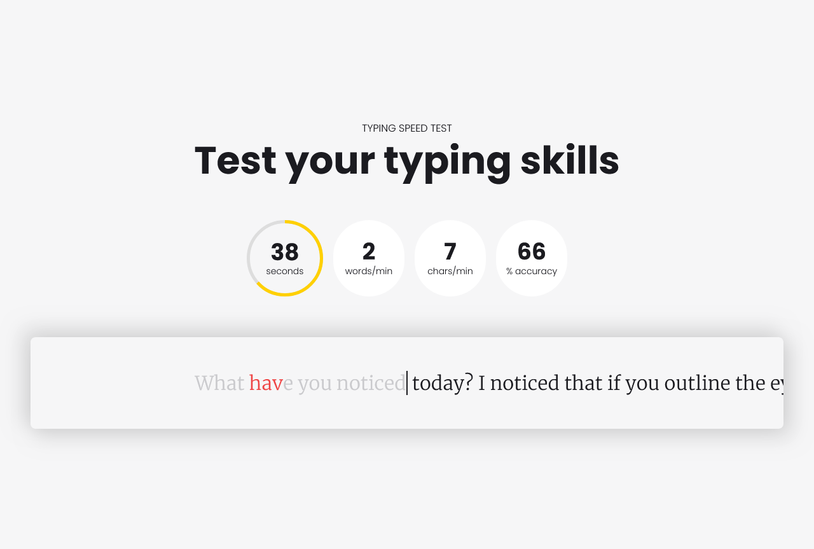

# Typing Test

A sleek and modern typing speed test application built with **Next.js**, **Tailwind CSS**, and **ShadCN**. This application provides a smooth and engaging typing experience, displaying words per minute (WPM) and accuracy.

## Tech Stacks

   

## Features

- **Typing Speed Test**: Measure your typing speed in words per minute (WPM).
- **Accuracy Calculation**: Get real-time feedback on your typing accuracy.
- **Modern UI**: Built with **Tailwind CSS** and **ShadCN** for a clean and aesthetic user interface.
- **Real-Time Feedback**: Instant feedback on typing speed and accuracy as you type.

## Screenshots



## Installation

1. **Clone the repository**:

   ```bash
   git clone https://github.com/lazyjinchuriki/typing-test.git
   cd typing-test
   ```

2. **Install dependencies**:

   ```bash
   npm install
   ```

3. **Start the development server**:

   ```bash
   npm run dev
   ```

   Visit [http://localhost:3000](http://localhost:3000) in your browser to view the app.

## Usage

Once the server is running, you can start the typing test and receive real-time feedback on your typing speed and accuracy.

## Customization

You can customize the app by editing the files in the `/app/` and `/components/` directories. Each feature is modular, making it easy to enhance or modify.

## Contributions

Contributions are welcome! Please create an issue or submit a pull request to help improve the project.

## Contact

If you have any questions or feedback, feel free to reach out at [rahulkhushalani@proton.me](mailto:rahulkhushalani@proton.me).

### Support

If you found this project helpful, consider supporting me:

<a href="https://www.buymeacoffee.com/lazyjinchuriki">
  
</a>

## Social

Follow me on my social channels for more updates:

[](https://www.instagram.com/amundaneguy/)
[](https://www.linkedin.com/in/rahul-khushalani-77ab21201/)
